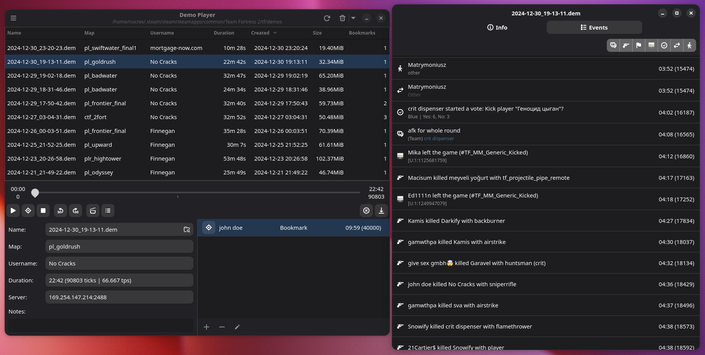

# TF2 Demo Player
This is an in-development application for managing and playing back TF2 demos, though it may work with other source games aswell.



## Features
+ Listing demos with their properties (name, map, length,...)
+ Managing Bookmarks made with the in-game demo tools
+ Integration with rcon to:
    + Play back the selected demo in-game
    + Skip to timestamp/bookmark
+ Add descriptions/notes to demos
+ Convert demos to replays with acurrate metadata
+ Parse demos and display players and chat messages (with more stuff to be added soon)

## Usage
To be able to use the playback functions of the app TF2 needs to be configured to enable client rcon.
To do this you need to add `-usercon` to your launch parameters on steam and add this to your autoexec.cfg:

```
ip 0.0.0.0
rcon_password <password>
net_start
```
Then put the same password in the settings and test the connection with the button there. If it says "Connection successful" you're good to go.

## Building
To build this app you first need to install rust and the GTK4 development libraries as described [here](https://gtk-rs.org/gtk4-rs/stable/latest/book/installation.html).

Once the required libraries are installed, building should be as easy as typing 
```
cargo build
```
in the project root.
